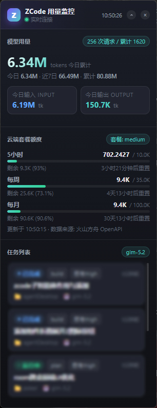

# ZCode 用量监控桌面组件

一个轻量的桌面悬浮小组件，用于实时监控 [ZCode](https://zcode.app) 智能体的运行状态与 token 用量。基于 `pywebview` 实现无边框、置顶的桌面悬浮窗，每 2 秒刷新一次本地数据。




## 功能

组件在一个紧凑的悬浮窗内展示三类信息：

- **模型用量** — 今日 / 本周 / 累计的输入、输出、缓存读取、推理 token 数与请求次数，按模型分解。数据来自 ZCode 本地持久化的 `model_usage` 表（与 ZCode 设置面板中"今日 / 累计"一致）。
- **云端套餐额度**（可选）— 读取火山方舟 OpenAPI 的 CodingPlan（编程套餐）各窗口（会话 / 每周 / 每月）的已用百分比与重置时间。配置 `VOLC_PLAN_START` 后还会**倒推各窗口内的本地 token 明细**，悬浮显示该窗口内各模型的消耗总计与占比。未配置凭证时该区块自动隐藏。
- **任务列表** — 最近执行的 ZCode 任务，显示标题、状态、模型、时间，点击可一键在 ZCode 中打开对应工作区。

此外还支持：窗口拖拽、置顶悬浮、点击右上角或 Z 图标折叠 / 展开面板、实时活动日志（当前正在执行的工具调用与最近事件流）。

## 数据来源

组件只读取本地数据，不做任何写入：

| 数据 | 路径 | 说明 |
| --- | --- | --- |
| 任务索引 | `~/.zcode/v2/tasks-index.sqlite` | 当前 / 运行中任务与最近任务列表 |
| token 用量 | `~/.zcode/cli/db/db.sqlite`（`model_usage` 表） | 本地持久累计的 token 计数，权威来源 |
| 实时活动 | `~/.zcode/cli/log/zcode-<date>.jsonl` | 工具调用 / 模型活动事件流 |
| 云端套餐 | 火山方舟 OpenAPI | 只读查询，需自行配置凭证 |

## 环境要求

- **直接用 exe**：Windows 10/11（自带 WebView2 运行时），无需安装 Python
- **从源码运行**：Python 3.10+，Windows / macOS / Linux

## 快速开始

### 方式一：直接下载 exe（推荐，无需装 Python）

1. 前往 [Releases](https://github.com/Oct1AtJoe/zcode-desktop/releases/latest) 下载 `zcodeDesktop.exe`
2. 双击即可运行，本地 token 用量开箱即用
3. （可选）如需展示云端套餐额度，在 exe 同目录创建 `.volc.env` 文件，内容参考下方的[凭证配置](#凭证配置)

### 方式二：从源码运行

```bash
# 1. 安装依赖
pip install -r requirements.txt

# 2. 启动
python widget.py
```

Windows 用户也可双击 `启动组件.bat` 启动（会优先使用无控制台窗口的 `pythonw`）。

### 凭证配置

不配置 `.volc.env` 也能正常运行--本地 token 用量照常展示，仅「云端套餐额度」区块会自动隐藏。

如需云端套餐用量，创建 `.volc.env` 文件（内容参考 [`.volc.env.example`](.volc.env.example)）：

```ini
VOLC_AK_ID=你的AccessKeyID
VOLC_AK_SECRET=你的SecretAccessKey
# 套餐类型：coding（编程套餐，默认）或 agent（旧版 AgentPlan）
VOLC_PLAN_TYPE=coding
# 套餐档位（可选）：标注你开通的档位，如 Pro / 标准版 / Max
VOLC_PLAN_TIER=Pro
# 套餐开通时间（coding 套餐可选）：用于倒推 weekly/monthly 窗口的本地 token 明细
# 格式：2026-07-15T23:19:00 或 2026-07-15 23:19:00
# 去火山方舟控制台 -> 方舟 -> CodingPlan 订阅页查「开通时间/生效时间」
# 未配置时 session 窗口正常统计, weekly/monthly 显示引导提示
VOLC_PLAN_START=2026-07-15T23:19:00
```

`VOLC_PLAN_TYPE` 选择你开通的套餐，决定组件调哪个接口取额度：

| 值 | 套餐 | 接口 | 展示 |
| --- | --- | --- | --- |
| `coding` | 编程套餐 | `GetCodingPlanUsage` | 各窗口已用百分比 + **分模型 token 明细**（悬浮显示） |
| `agent` | 旧版 AgentPlan | `GetAFPUsage` | 绝对额度 / 已用 / 剩余 |

不填则默认 `coding`（当前在售套餐）。换套餐时改这一项重启即可。

`VOLC_PLAN_TIER`（可选）用于标注套餐档位。火山接口只返回运行状态（如 `Running`）、不返回档位（Pro / 标准版 / Max），所以档位由你自行填写，组件会在角标显示成"编程套餐·Pro"。留空则只显示"编程套餐"。

`VOLC_PLAN_START`（coding 套餐可选）是套餐开通时间。配置后，组件会根据云端返回的各窗口重置时间，倒推窗口起点，对本地 `model_usage` 表聚合该窗口内的 token 消耗，悬浮显示总计与各模型占比。未配置时 session 窗口正常统计，weekly/monthly 显示引导提示。

放到以下任一位置即可：

- **exe 同目录**（推荐）-- `zcodeDesktop.exe` 旁边
- **用户家目录** -- `C:\Users\你的用户名\.volc.env`
- 也可设置系统环境变量 `VOLC_AK_ID` / `VOLC_AK_SECRET`

获取方式：登录 [火山引擎控制台](https://console.volcengine.com/) -> 方舟（OpenAPI）-> 创建 AccessKey。

## 打包为 exe（可选）

可将项目打包成单个 `zcodeDesktop.exe`，双击即可运行，无需安装 Python 环境：

```bash
pip install pyinstaller

pyinstaller --onefile --windowed --name zcodeDesktop --icon icon.ico \
  --collect-all webview --collect-all clr --collect-all requests \
  --add-data "widget.html;." --add-data "icon.ico;." widget.py
```

生成的 exe 在 `dist/zcodeDesktop.exe`（约 17 MB，依赖 Windows 自带的 WebView2 运行时）。

## 项目结构

```
widget.py              # 入口：创建悬浮窗 + 绑定 JS 桥 + 设置任务栏图标
widget.html            # 前端界面（单文件，含样式与逻辑）
data.py                # 数据后端：读取本地 SQLite / 日志 + 火山 OpenAPI 签名调用
test_volc_usage.py     # 火山方舟 OpenAPI 用量查询的独立测试脚本
icon.ico               # 任务栏图标（紫青渐变 Z）
启动组件.bat           # Windows 启动脚本
.volc.env.example      # 火山凭证模板（复制为 .volc.env 后填入）
requirements.txt
```

## 许可证

[MIT](./LICENSE)
